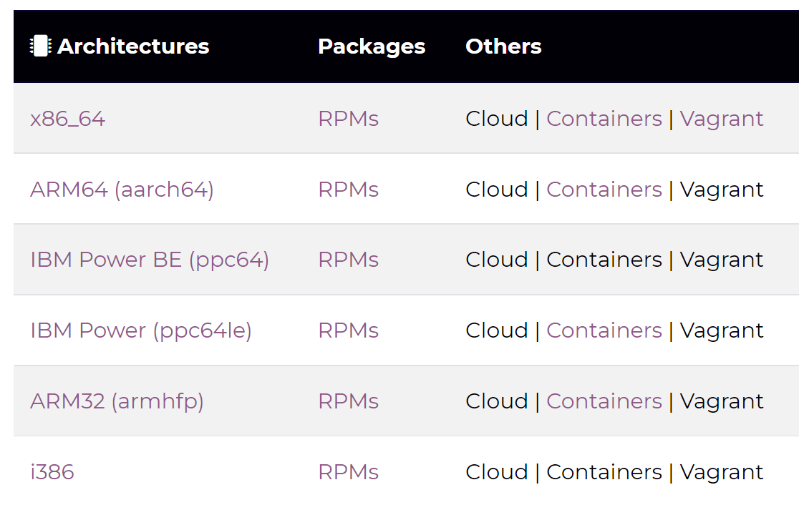
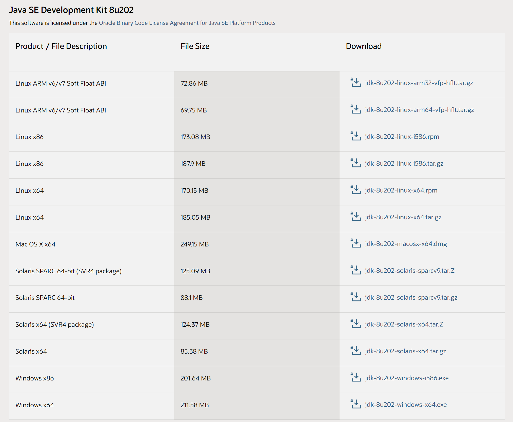
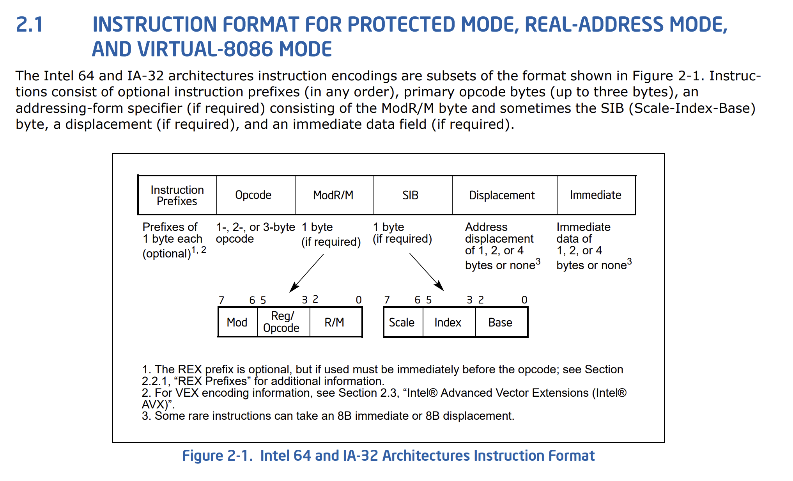
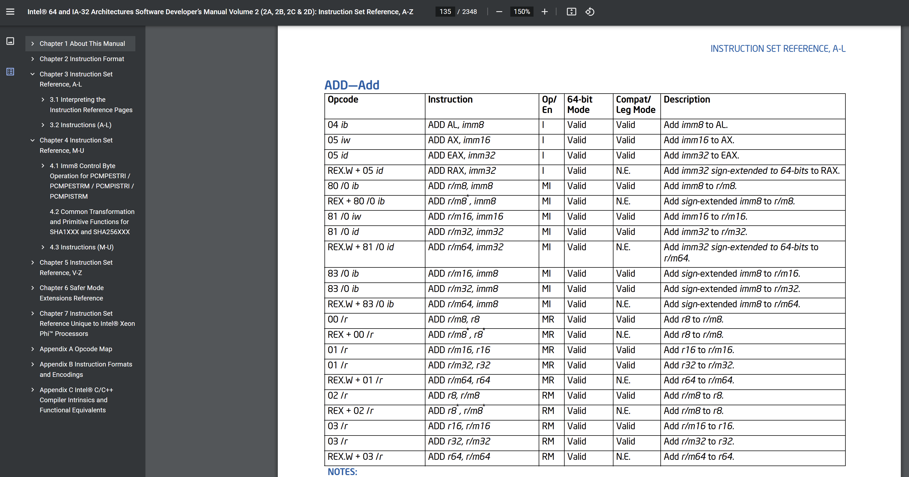
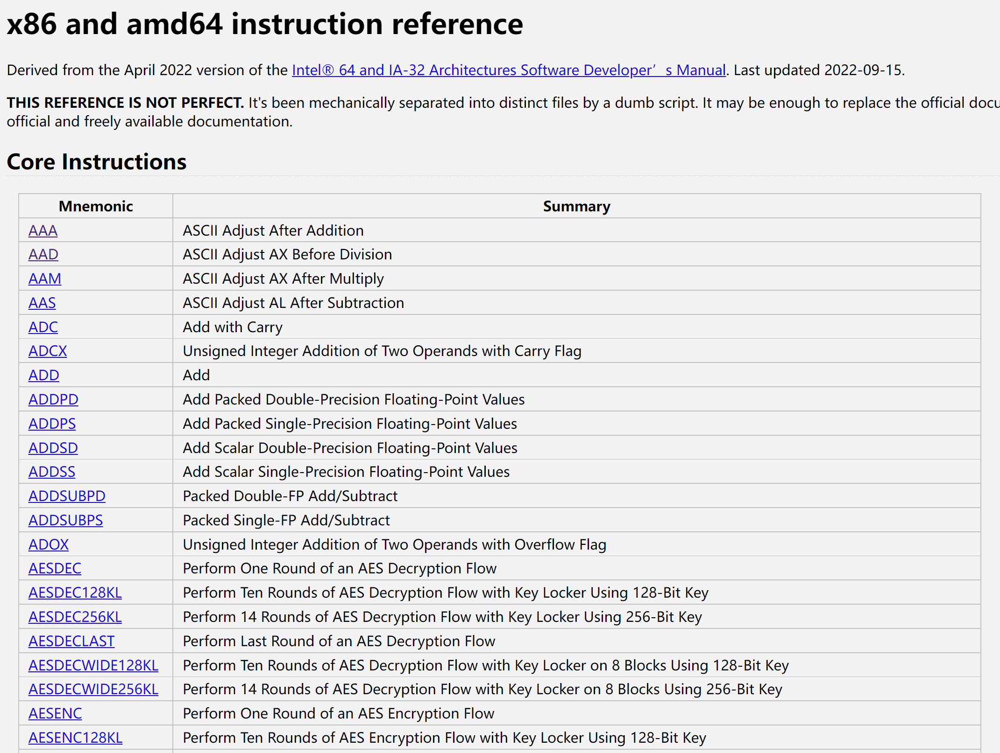
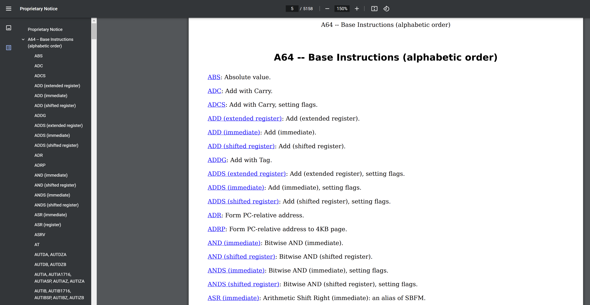
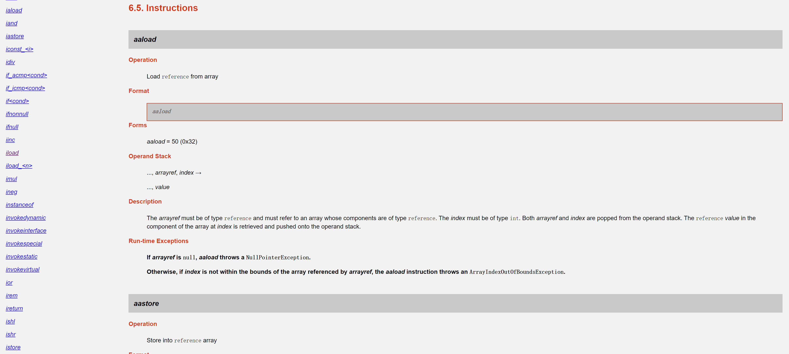

# 1.1 从 ISA 开始说起

在开篇词中我说过，我们将自底向上一层一层推导出整个计算机体系大厦。所以这个底必须有个起点，对于软件工程师来说，从 ISA 作为起点就再合适不过了，我们没有必要再去过多关心下面的硬件细节。

## 1.1.1 简单理解 ISA 是什么

ISA 的全称是 Instruction Set Architecture，翻译过来就是指令集架构，有时候我们也常说处理器架构。不论你的处理器（CPU）内部被设计成什么样，你只需要告诉开发者你的指令集架构即可。

比如有一款 CPU，我们姑且叫它 CPU-A，它用如下三个字节的指令表示将内存 0x00 地址处的 +1：

0x89 0x00 0x01

具体说来，0x89 表示将内存某地址处的值加上一个数；0x00 表示要操作的内存地址；0x01 就表示要加的那个数，也就是 1。

通常来说，CPU 就是不断从内存中读取指令并执行，当 CPU 读取到刚刚那三个字节后，就会将内存地址 0x00 处的值 +1，这就是最终的效果。至于内部是如何完成的，我们站在 ISA 的层面就无需关心了。

这时，假如有另外一款 CPU，我们姑且叫它 CPU-B，要完成刚刚同样的效果，即将内存 0x00 地址处的值 +1，需要如下指令：

0x44 0x00 0x01

这里就与上面的那款 CPU-A 的指令有所不同，我们说这两款 CPU 的 ISA 是不同的。

显然，这款 CPU-B 是无法运行写给 CPU-A 的程序的，因为在 CPU-A 的眼里，0x89 才是加法操作指令，而在 CPU-B 眼里，0x44 才是加法操作指令，这怎么可能互相兼容呢？

当然，换另一个角度说，假如两款 CPU 的指令集完全相同，那不论硬件结构设计成什么样，对开发者来说，都是无所谓的，我们只需要面向 ISA 编程即可。

## 1.1.2 哪些地方体现了 ISA 的不同

其实刚刚讲述的概念，早在你编程生涯中的很多地方见过了。

比如你要下载一个 [CentOS Linux](https://www.centos.org/centos-linux/#download)，会让你具体选择具体的处理器架构，下图中的 Architectures 就是 ISA 的含义。

我们最常见的就是 Intel 的 x86_64 架构处理器，以及目前 PC 市场份额还不高的 ARM 的 aarch64 架构处理器。如果你下载了 aarch64 架构的 CentOS 然后安装在 x86_64 的处理器上，那显然是不行的，道理和上一部分讲的 CPU-A 和 CPU-B 指令集不兼容的道理是一样的。

我们再来看一个案例，相信大部分 Java 程序员都安装过 JDK，访问 [Oracle 官网的 JDK 下载页](https://www.oracle.com/java/technologies/downloads/archive/)，随便选择一个 JDK8 的小版本，会看到如下列表。

在这里，我们再次看到了不同 ISA 的区别，如果你下载了一个 jdk8u202-linux-arm64-vfp-hflt.tar.gz 的包，去 Linux x64 平台中跑 Java 程序，显然是不可以的。感兴趣的你也可以试试，看看它会报什么错误。

这里还有个更有趣的点，即 JDK 不同于刚刚的 CentOS，它不但区分了不同的 ISA，同时也区分了不同的操作系统（linux，windows，macosx 等），这是为什么呢？

在这里展开讲解并不合适，但我们通过 ISA 的思想也能很好地类比猜测。既然处理器向上暴露的 ISA 的不同使得上层的应用程序需要有所区分，那么操作系统的不同也一定导致其向上暴露的某些东西不一样了，那么不同操作系统下的应用程序也就要做相应的区分处理。

好了，点到为止，在这一小节，你只需要知道，不同的 ISA 架构的表现，早在我们编程生涯中的方方面面有所体现，CentOS 和 JDK 的下载就需要对其进行区分。

## 1.1.3 如何查看 ISA

现在，我们已经知道了 ISA 是什么，并且也知道了原来我们下载软件的时候早就见识过了 ISA 不同所造成的影响。

那么接下来，我们就要从 ISA 出发，逐步向上建立其我们整个的计算机大厦了。永远记住要有分层思想，不要去思考 ISA 下方的大厦，它们已经由图灵、冯诺依曼、芯片设计与制造厂商为我们建立好了，我们要站在巨人的肩膀上，才能走得更远。

既然从 ISA 出发，我总得知道去哪里查不同的 CPU 的 ISA 手册吧？

### 1 Intel 手册

拿 Intel x86 架构 CPU 来说，其对应的 ISA 手册就在 [Intel® 64 and IA-32 Architectures Software Developer’s Manuals](https://www.intel.com/content/www/us/en/developer/articles/technical/intel-sdm.html) Volume 2 中，就是通常讲的 Intel 手册卷 2。

开篇从整体上介绍了指令格式，比如 Opcode 就是我们常说的操作码。而在随后的章节里，从首字母 A-Z 逐一介绍了全部 Intel x86 架构的指令，包括该指令的详细用法，就像一本无情的字典一样。

注意，实际上在 CPU 视角中，ISA 就是一堆 0101 这种二进制数值，即机器码。之所以手册写为英文字母，比如上面的 ADD，是因为这得给人看，需要有个助记符号，总不能直接写成完全看不懂的机器码吧。

当然这个手册过于正式了，如果你仅仅想体会一下指令集大字典这种感觉，可以看一个经过整理的网站：[x86 and amd64 instruction reference](https://www.felixcloutier.com/x86/)，这里更加无情地列出了全部指令，也是按照首字母排序。

### 2 ARM 手册

Intel x86 ISA 属于 CISC，即复杂指令集架构，其指令数量很多，复杂程度也很高。

我们接下来看一下 ARM 的 aarch64，其对应的手册叫 [Arm A-profile A64 Instruction Set Architecture](https://developer.arm.com/documentation/ddi0602/2022-12/?lang=en)，名字非常简单直接。相比于 Intel x86 来说，属于精简指令集架构（RISC）的 aarch64 手册就显得非常友善。

### 3 JVM 手册

上面两个都是物理上真实存在的处理器，那既然 ISA 之下的具体实现我们无需关心，那这个实现是否可以是虚拟的呢？答案是可以的，就是虚拟机嘛~

对于广大 Java 程序员来说，JVM 即 Java 虚拟机就再熟悉不过了。

不过，不管你是物理机还是虚拟机，终究还是逃不过向上暴露的 ISA。那么对于 JVM 来说，它的 ISA 就是字节码。它的 ISA 手册，就在 JVM 虚拟机规范里，即 [The Java Virtual Machine Specification](https://docs.oracle.com/javase/specs/index.html)。

在章节 6.5 Instructions 里，就又是像 Intel 与 Arm 手册那样，一条一条字节码指令地列出来，并给出详细的解释。

只不过，真实的物理机的 ISA 手册解释每一条指令的时候，面向的是寄存器和内存等。而对于 JVM 来说，就是面向局部变量表、操作数栈等虚拟的概念罢了，其思想是一样的。

既然我们可以不关心真实物理机的底层实现，只需要知道每一条指令的最终效果即可，那么对于 JVM 来说，我们也可以仅仅知道每一条字节码的最终效果，而不去关心它的内部实现。甚至对于大部分 Java 程序员来说，只关心 Java 语言层面的效果即可，JVM 层面的事情也无需操心。

这里再次体现了分层思考问题的好处，请大家时刻牢记。

## 1.1.4 直观体会下面向 ISA 编程

### 1 eater 的 6502

https://eater.net/6502

### 2 logisim 模拟

https://github.com/leonicolas/computer-8bits
